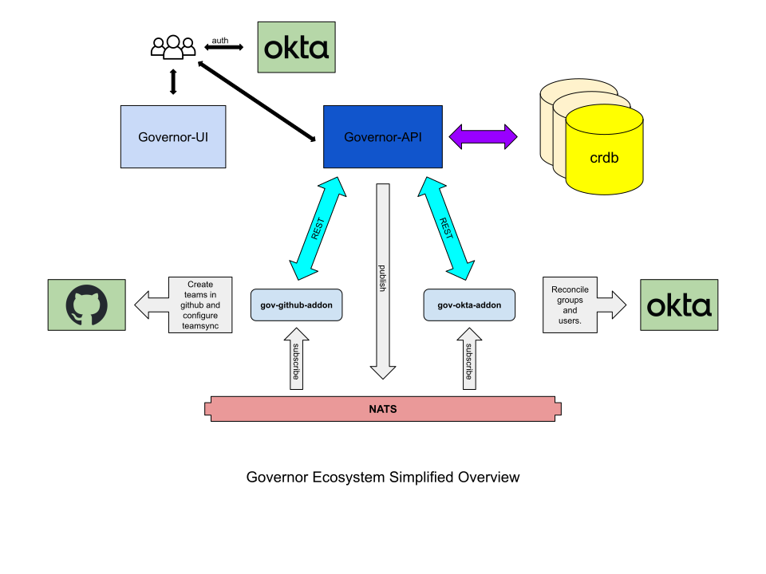

# Governor API



The Governor ecosystem provides cohesive access management across a variety of services.  Primarily, it manages groups and users in an IDP, along with roles and groups in integrated services.  It provides a web interface for users to login, request group enrollments, creates and manage groups as well as application integrations. It provides self service identity and access management with built-in approvals and auditing.  This repository contains the backend component of Governor.  If you are looking for the UI, head over to [this repo](https://github.com/metal-toolbox/governor-ui).  Application integrations are abstracted into Governor Addons which are notified of changes via NATS.  Some example addons are:

* [gov-okta-addon](https://github.com/metal-toolbox/gov-okta-addon)
* [gov-github-addon](https://github.com/metal-toolbox/gov-github-addon)
* [gov-splunk-addon](https://github.com/metal-toolbox/gov-splunk-addon)

## Getting started

For local development, this project ships with a [`Makefile`](./Makefile) and [`docker-compose.yml`](./docker-compose.yml). This requires you to have a `docker-compose` compliant container run time for this guide.  In addition, there is experimental support for a devcontainer.

### Prerequisite

#### cockroach cli tool

The `cockroach` binary is necessary for some of the tooling and also for the tests. If you are a Homebrew user, you can install it with: `brew install cockroachdb/tap/cockroach`.

#### sqlboiler-crdb

If you are editing models, you will need to install the sqlboiler-crdb tool by running:

```sh
go install github.com/glerchundi/sqlboiler-crdb/v4
```

#### nsc tool for nats

```
brew tap nats-io/nats-tools
brew install nats-io/nats-tools/nsc
```

### Running Governor API Locally

To start, run `make docker-up`.

This will bring up a local instance of `cockroach` db, `nats`, and the `governor` api.  Governor will perform a database migration to ensure the database is prepared for use, and then `gin` will begin listening at the configured address, which by default is [localhost:3001](http://localhost:3001).

The Governor API requires auth. To aid with development, a local development hydra is provided through the make target `make dev-hydra`. This make target sets up a valid hydra configuration, creates a client, and provides a command by which to fetch a JWT through a client credentials flow. See the `dev-hydra` target in [Makefile](Makefile) for more information.

Once you have a hydra client (and secret) you can generate a token like so:

```
docker-compose exec hydra hydra token client \
    --endpoint http://hydra:4444/ \
    --client-id governor \
    --client-secret ${SECRET} \
    --audience http://api:3001/ \
    --scope write,read:governor:users,read:governor:groups,read:governor:organizations,read:governor:applications
```

This will return a JWT, which can be uses as the Bearer token to communicate with the API.

### Testing

Once you're ready to run the tests, you can of course run the standard `go test -v ./...` but it may be helpful too to run the integration tests. To do that, you'll want to up the database, then run the tests passing the test tags:

```sh
docker-compose up -d crdb
make test-database
go test -tags testtools -v ./...
```

to run all of the tests, simply execute `make test`.

## Development

### Devcontainer

The easiest way to get a local dev environment is by using VSCode with Devcontainer. Make sure you have Docker installed locally, and install the [Remote Development Extension](https://marketplace.visualstudio.com/items?itemName=ms-vscode-remote.vscode-remote-extensionpack) in your VSCode. You can then launch it from VSCode by pressing F1 and selecting `Dev Containers: Reopen in Container`. This will create all the required pre-requisite containers, such as crdb, nats and hydra, and will set up a development Linux container.

You can run all the usual commands from the VSCode Terminal, e.g. `make lint` or `make test-local`. Note that some of the existing make commands that call docker-compose will not work from the devcontainer.

To start the governor-api, just run:
```
go run . serve --config .governor-dev.yaml --audit-log-path audit.log
```

Port 3001 should be automatically forwarded to your local machine, so you can connect to the API as usual.

### Making yourself an admin

By default when you first start a local Governor API and log in from the UI you will be registered as a regular user. To make yourself an admin, you need to create and add yourself to the Governor Admins group.

Create a group called `Governor Admins` from the local Governor UI and note the group id from the path (it will be something like `927e5034-163b-43be-b12c-083ce2a368ce`).
Next go to Users, click your user and copy the user id. You'll need both the group and user ids to add yourself directly from the database.

Log into the local cockroach database:
```
cockroach sql
\c defaultdb
```

Run the following query after replacing the `GROUP_UUID` and `USER_UUID`:
```
INSERT INTO group_memberships (group_id,user_id,is_admin,created_at,updated_at) VALUES ('GROUP_UUID','USER_UUID',true,NOW(),NOW());
```

Reload the UI and you should be a site admin now.

### Local Test Data

To create data for your local governor instance, while your cockroach instance is running, run `make test-local-init`. This will wipe your old data (except your governor admin data) and create some test data to use when testing locally.

### Models in Governor

We model database tables with `sqlboiler`, you can find the repo with docs [here](https://github.com/volatiletech/sqlboiler).

`sqlboiler` is a database first approach to ORM, in that you first create the database schema when changing the model, then `sqlboiler` autogenerates model code from the database.

So, to make changes to a model, one must first update `db/migrations` to create a *new* database migration that results in the change necessary, then run that migration, and lastly `sqlboiler` has to be run against the resulting database to regenerate the models.

To aid with this, there is a `Makefile` target that should help. To make updates, edit the SQL source in `db/migrations`, then run `make generate-models`.  Theis will attempt to resolve the sqlboiler deps and manage the `crdb` instance for you.

## References

If you change this code, you're likely to need these references:

|Link|Description|
|-|-|
|[SQLBoiler Readme](https://github.com/volatiletech/sqlboiler)|The readme hosts great documentation for getting started with models or queries|
|[Gin Readme](https://github.com/gin-gonic/gin)|The gin readme likewise hosts great documentation for query params, and most of what you need|
