# Extend Governor APIs

**Governor Extensions** allows the Governor API itself to be
extended, in a design that is heavily influenced by Kubernetes' CRD and operator
patten.

See [Governor Extension Example](https://github.com/equinixmetal/governor-extension-example)
for a complete implementation of a Governor Extension.

## Data Schema


## Extension Life Cycles

### Extension Registration and Bootstrapping

- [Example Bootstrapping](https://github.com/equinixmetal/governor-extension-example/blob/main/internal/server/bootstrap.go)
- [Example Deployment](https://github.com/equinixmetal/k8s-governor-extension-example/blob/main/values.yaml#L15)

After the development of the extension itself, the admin will initiate the
registration process prior to the deployment of the extension,
the Governor API will then create an extension entity with its UUID.
This UUID will be deployed with the extension (e.g. env var), and the extension,
in turn, will use this UUID to gather all the necessary information to facilitate
the process.

A future improvement is shown below and can be added when governor API has the
capability of provisioning NATS credentials.


### Serving an Extension

- [Example: Event Subscription](https://github.com/equinixmetal/governor-extension-example/blob/main/internal/server/events.go)
- [Example: Event Processing](https://github.com/equinixmetal/governor-extension-example/blob/main/pkg/greetings/process.go)


### Update

JSON schema for extension resource definition should be immutable, new versions
of the resource definition can be created. Otherwise the bootstrap process
is the same as shown above.

### Disabling


### Removal


## Endpoints

### Extension Management

| Operation | Method | URI  |
|---|---|---|
| **list** | `GET` | /api/v1alpha1/extensions |
| **create** | `POST` | /api/v1alpha1/extensions |
| **get** | `GET` | /api/v1alpha1/extensions/:slug-or-id |
| **update** | `PATCH` | /api/v1alpha1/extensions/:slug-or-id |
| **delete** | `DELETE` | /api/v1alpha1/extensions/:slug-or-id |

### Extension Resource Definitions Management

| Operation | Method | URI  |
|---|---|---|
| **list** | `GET` | /api/v1alpha1/extensions/:extension-slug-or-id/erds |
| **create** | `POST` | /api/v1alpha1/extensions/:extension-slug-or-id/erds |
| **get by ID** | `GET` | /api/v1alpha1/extensions/:extension-slug-or-id/erds/:uuid |
| **get by slug** | `GET` | /api/v1alpha1/extensions/:extension-slug-or-id/erds/:slug-singular/:version |
| **update by ID** | `PATCH` | /api/v1alpha1/extensions/:extension-slug-or-id/erds/:uuid |
| **update by slug** | `PATCH` | /api/v1alpha1/extensions/:extension-slug-or-id/erds/:slug-singular/:version |
| **delete by ID** | `DELETE` | /api/v1alpha1/extensions/:extension-slug-or-id/erds/:uuid |
| **delete by slug** | `DELETE` | /api/v1alpha1/extensions/:extension-slug-or-id/erds/:slug-singular/:version |

### User Resources

#### Prefixes

- authenticated user resources: `/api/v1alpha1/user/extension-resources`
- admin managing user resources: `/api/v1alpha1/users/:user-id/extension-resources`

#### URIs

| Operation | Method | URI  |
|---|---|---|
| **list** | `GET` | /\<prefix\>/\<extension-slug\>/\<erd-slug-plural\>/\<erd-version\> |
| **create** | `POST` | /\<prefix\>/\<extension-slug\>/\<erd-slug-plural\>/\<erd-version\> |
| **get** | `GET` | /\<prefix\>/\<extension-slug\>/\<erd-slug-plural\>/\<erd-version\>/\<er-slug-or-id\> |
| **update** | `PATCH` | /\<prefix\>/\<extension-slug\>/\<erd-slug-plural\>/\<erd-version\>/\<er-slug-or-id\> |
| **delete** | `DELETE` | /\<prefix\>/\<extension-slug\>/\<erd-slug-plural\>/\<erd-version\>/\<er-slug-or-id\> |

### System Resources

#### URI Prefixes

- use existing `/v1alpha1/` api group: `/api/v1alpha1/extension-resources`

#### Resource URIs

| Operation | Method | URI  |
|---|---|---|
| **list** | `GET` | /\<prefix\>/\<extension-slug\>/\<erd-slug-plural\>/\<erd-version\> |
| **create** | `POST` | /\<prefix\>/\<extension-slug\>/\<erd-slug-plural\>/\<erd-version\> |
| **get** | `GET` | /\<prefix\>/\<extension-slug\>/\<erd-slug-plural\>/\<erd-version\>/\<er-slug-or-id\> |
| **update** | `PATCH` | /\<prefix\>/\<extension-slug\>/\<erd-slug-plural\>/\<erd-version\>/\<er-slug-or-id\> |
| **delete** | `DELETE` | /\<prefix\>/\<extension-slug\>/\<erd-slug-plural\>/\<erd-version\>/\<er-slug-or-id\> |

### Examples

`user-1` is an admin, `user-2` is a regular user. URI prefixes approach-2 is chosen,
all extensions are hypothetical

1. admin registers notification extension

    ```HTTP
    POST /api/v1alpha1/extensions
    {
      "url": "notifications.governor.svc"
      "name": "notifications"
      "description": "notifications"
    }
    ```

1. users checks their own `notification-preferences` provided by the notification extension

    ```HTTP
    GET /api/v1alpha1/user/extension-resources/notifications/notification-preferences/v1
    ```

1. admin checks `user-2`'s `pager-duty-groups` provided by the pager duty extension

    ```HTTP
    GET /api/v1alpha1/users/user-2/extension-resources/pager-duty/pager-duty-groups/v1
    ```

1. admin updates system resource `notification-targets` provided by the notification extension

    ```HTTP
    PATCH /api/v1alpha1/extension-resources/notifications/notification-targets/v1/slack
    ```

## Events

Example Event:

```json
{
  "subject": "<resource-slug>",
  "version": "v1alpha1",
  "action": "create",

  "extension-resource-id": "some-id"

  // ... optional metadata
  // group ID
  // user ID
  // application ID
}
```

## Trace

Governor API populates `TraceContext` to each event it emits to the event bus,
extensions can inherit the parent parent trace context in `event.TraceContext`.

[Example](https://github.com/equinixmetal/governor-extension-example/blob/main/pkg/greetings/process.go#L83-L86)

## VIPs

Very interesting problems.

In some cases, an extension or multiple extensions might need to update the
resources upon reconciliation. This could lead to potential issues like the
extensions reacting to its own updates.

### Extensions update loop


The above scenario can be mitigated by allowing the extensions to keep a
local copy (cache) of the resource and only react to changes when the resources
in Governor is actually changed from their own cache.

However, local cache will not solve the issue where there are multiple extensions
reacting to updates on the same resource. More precisely, the extensions will
likely react to the same update $N$ times per extension,
where $N$ is the number of extensions that react to same resource.
(It will eventually stop because eventually the updates will not change any
values in the resource, **unless** the extension is updating the resource
with a unique value that changes every time, e.g. timestamps).

### Annotations

To mitigate this problem, **Annotations** can be introduced
to the extension resources, and having the extension to mark a resource
as `processed`, then ignore any subsequent updates on resources with this
annotation.

Annotations in an extension resource should be a map of `string => any`,
the key of this map should follow this format:

```txt
proccessed.extension.governor/<extension_slug>
```

The type of the annotation value is up to the extension developer's design,
here are some example annotation values:

- boolean value: extension simply discard the event if `true`
- unix time stamp: indicates the last time the resource was processed by
  the extension, and the extension can apply an "expiry" to the annotation

### Multiple Extension Race Conditions


One of the solutions is to avoid having multiple extensions react on the same
extension resource, in doing so, not only will it increase the complexity of the system,
but also introduce a dependency from one extension to another. Nonetheless,
this is still a potential issue to be addressed.

### Resource Versioning

To mitigate this problem, **Resource versioning** can be introduced
to the extension resources. The governor API can generate a new UUID as the
resource version each time the resource is created or updated.
To update a resource, the extension must provide the resource version along
with the patch to the governor API, the the governor API will reject any
updates with resource version mismatches.

### Complete Solution Examples

Here are two examples showing how resource versioning and annotations will address the above
issues.

```mermaid
sequenceDiagram
  actor u as User
  participant g as Governor API
  participant m as Message Bus
  participant e1 as Extension 1
  participant e2 as Extension 2

  note over u, e2: create account example: prevent race condition

  u->>g: create /account
  activate g
  g->>m: publish event: an account was created
  activate m
  g->>u: response
  deactivate g

  m->>e1: receive event: <br/>an account was created
  activate e1

  m->>e2: receive event: <br/>an account was created
  deactivate m

  activate e2

  e1->>g: fetch resource with ID from event
  g->>e1: 

  e2->>g: fetch resource with ID from event
  g->>e2: 

  note over g, e2: resp: { "name": "Alice", balance: 0, "resource_version": "1" }

  e1->>e1: deposite $100
  e2->>e2: deposite $50

  e1->>g: update /accounts/:id
  activate g
  note over g, e1: payload: <br/>{ "balance": 100, "resource_version": "1", "annotations": { "proccessed.extension.governor/ext_1": true }}

  g->>g: update resource version<br/>to "2"
  g->>m: publish event: an account was updated 
  activate m

  g->>e1: 🚀 200 OK
  deactivate e1
  deactivate g

  e2->>g: update /accounts/:id
  activate g
  note over g, e2: payload: <br/>{ "balance": 50, "resource_version": "1", <br/>"annotations": { "proccessed.extension.governor/ext_2": true }}
  g->>e2: ❌ 400 Bad Request: resource version mismatch
  deactivate g

  loop retry until success or backoff
    e2->>g: fetch resource with ID from event
    g->>e2: 

    note over g, e2: resp: <br/>{ "balance": 50, "resource_version": "1", <br/>"annotations": { "proccessed.extension.governor/ext_2": true }}

    e2->>e2: deposite $50
    e2->>g: update /accounts/:id
    activate g
    note over g, e2: payload: <br/>{ "balance": 150, "resource_version": "2",<br/>"annotations": { "proccessed.extension.governor/ext_1": true,<br/>"proccessed.extension.governor/ext_2": true }}
    g->>g: update resource version<br/>to "3"
    g->>m: publish event: an account was updated 
    g->>e2: 🚀 200 OK
    deactivate g
  end

  deactivate e2

  note over u, e2: end of create account example

  note over u, e2: begin of prevent update loop example

  m->>e1: receive event: <br/>an account was updated
  activate e1

  m->>e2: receive event: <br/>an account was updated
  deactivate m

  activate e2

  e1->>g: fetch resource with ID from event
  g->>e1: 

  e2->>g: fetch resource with ID from event
  g->>e2: 

  note over g, e2: resp: <br/>{ "balance": 150, "resource_version": "2",<br/>"annotations": { "proccessed.extension.governor/ext_1": true,<br/>"proccessed.extension.governor/ext_2": true }}

  e1->>e1: verify annotation <br/>"proccessed.extension.governor/ext_1" already exists
  e2->>e2: verify annotation <br/>"proccessed.extension.governor/ext_2" already exists

  e1->>e1: discard event
  deactivate e1

  e2->>e2: discard event
  deactivate e2

  note over u, e2: end of prevent update loop example
```


