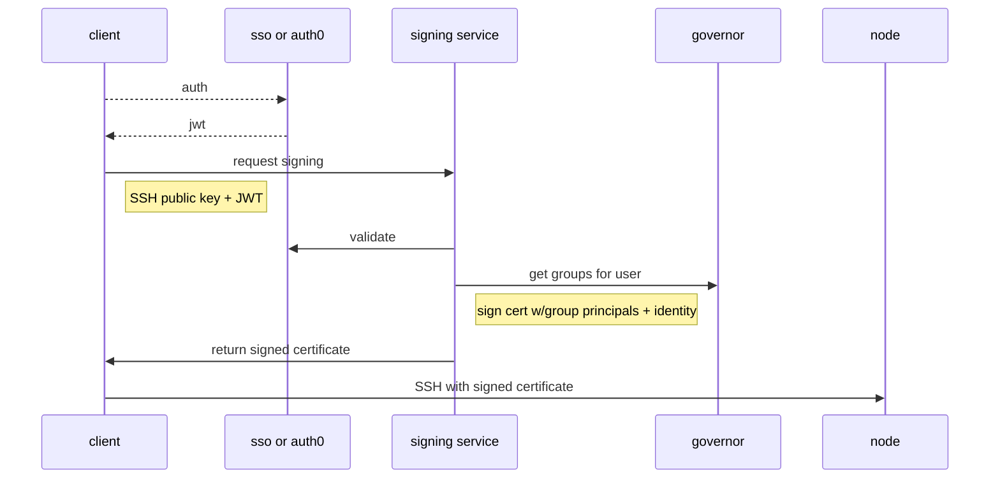

# Managing user access to hosts

## Current state

Currently, all users that need access to kubernetes nodes have their public SSH key added to the `authorized_keys` for the `core` user on each node.  This has several disadvantages, one being that we are unable to see who is actually logging in and running commands.

## Proposal

I propose that we move to SSH certificate based authentication and leverage a trusted CA to authenticate users who present a certificate signed by the CA.  We can continue to leverage the `core` user but configure sshd to log details about the certificate that was used to authenticate (it looks like it may already).  This will require generating and storing a CA.  The CA public key will be pushed out to all of our hosts.  This approach will require a signing service to be implemented that has access to the CA private key and with the ability to do oidc flows.  For the simplest user experience, the tool should integrate with `decuddle` natively.

### SSH certificate authentication

Leveraging SSH certificates with a trusted CA provides a single point of trust with minimal dependency on external infrastructure.  Signed certificates can be revoked and should have a short lifetime.  Each user that needs to access hosts over SSH will still generate an SSH keypair, but the public key will be signed by the CA.

We will configure the SSH daemon with the `TrustedUserCAKeys /etc/ssh/ca.pub` option to enable the use of a trusted CA.  We will need to provision the public CA certificate on the node at build or update time.  In addition, we will configure sshd to verify the authorized principal by governor group membership.  The governor group slugs that are allowed to access the node will be written out to `/etc/ssh/auth_principals/core` and sshd will be configured with `AuthorizedPrincipalsFile /etc/ssh/auth_principals/%u`.  This mechanism of authorization allows us to leverage the same CA to grant access to multiple security domains.

Note: The group slug should be unique, immutable and safe for use, however it could need further sanitizing (testing required).  In limited testing, special characters and whitespace break verification against the authorized principals.

### Signing Service

The certificate signing service will be a microservice running in kubernetes.  It will be responsible for taking in an unsigned SSH public key, validating the SSH public key and the user, crosschecking the groups from governor, signing the certificate with the groups as principals, the user as the identity and returning the signed certificate to the caller.  The CA will be managed using keymaker and kubernetes secrets.  The signing service will provide auditing for all signing requests.

The maximum lifetime for a certificate should be short and configured within the service.  There should be an optional lifetime field in the request payload if a shorter lifetime is desired. SSH certificates provide "certificate options"[^1] that could be leveraged in the future to limit the user even further.

### CLI

It should be possible to accomplish this flow and get back a signed certificate without the help of a client utility, however to make this more user friendly, we should offer this integration through a tool.  The CLI component should be added to the `decuddle ssh` command.  `decuddle` already includes an oauth flow against auth0.

### Risks

* Is correlation of the user with the certificate enough for auditing?
* If external dependencies fail, we should maintain a break glass ssh key for the core user in our secrets vault.

## References

[^1] https://man.openbsd.org/ssh-keygen.1#CERTIFICATES  
[^2] https://engineering.fb.com/2016/09/12/security/scalable-and-secure-access-with-ssh/  
[^3] https://smallstep.com/blog/diy-single-sign-on-for-ssh/  
